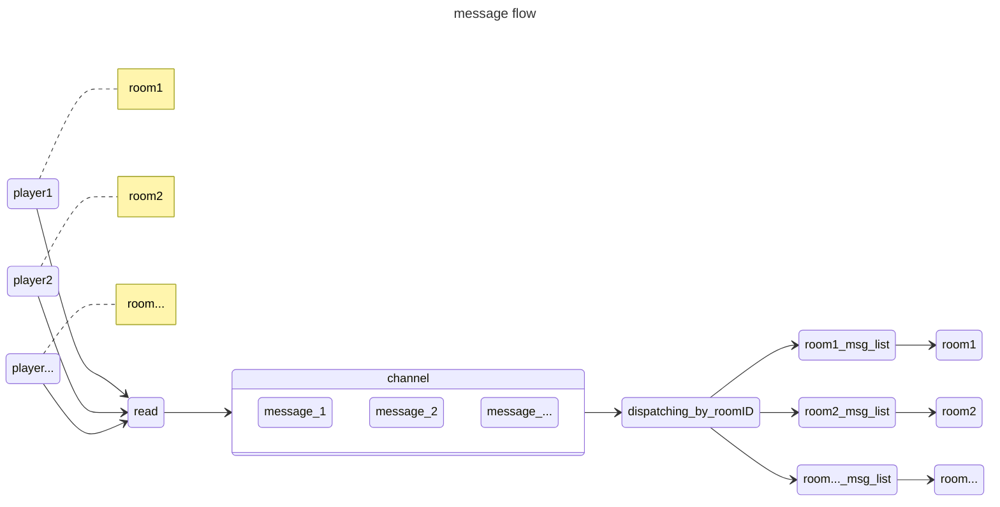
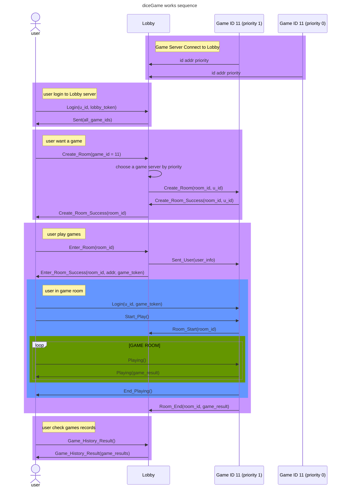

# diceGame: Distributed architecture game server  <!-- omit from toc -->

diceGame is a Lua game engine, basic Lua VM [gopher-lua](https://github.com/yuin/gopher-lua). It provides Lua APIs that allows you focus on game-play process.
Every single game `Room` owns a Lua VM and player's requests are sent in order to it. As you can see, there's nothing to worry about concurrency or network connectivity.
Check here for [how it works](#how-it-works)

- [Build And Run](#build-and-run)
- [Lua APIs](#lua-apis)
    - [**`Room Create`** lua start](#room-create-lua-start)
    - [**`Room Destroy`** Room:destroy()](#room-destroy-roomdestroy)
    - [**`Player Entry`** Room:PlayerIn(player)](#player-entry-roomplayerinplayer)
    - [**`Player Clear`** Room:PlayerOut(player.id)](#player-clear-roomplayeroutplayerid)
    - [**`Player Offline`** Player:Offline()](#player-offline-playeroffline)
    - [**`Player Request`** Player:OP(line, data)](#player-request-playeropline-data)
    - [**`Player Response`** Player:Send(line, data)](#player-response-playersendline-data)
    - [**`Timer Create`** Room:NewTimer(Millisecond, function, ...)](#timer-create-roomnewtimermillisecond-function-)
    - [**`Timer Exist`** Room:ExistTimer()](#timer-exist-roomexisttimer)
    - [**`Timer Left`** Room:TimerLast()](#timer-left-roomtimerlast)
    - [**`Timer Cancel`** Room:CancelTimer()](#timer-cancel-roomcanceltimer)
    - [**`Timer Create`** Player:NewTimer(Millisecond, function, ...)](#timer-create-playernewtimermillisecond-function-)
    - [**`Timer Exist`** Player:ExistTimer()](#timer-exist-playerexisttimer)
    - [**`Timer Left`** Player:TimerLast()](#timer-left-playertimerlast)
    - [**`Timer Cancel`** Player:CancelTimer()](#timer-cancel-playercanceltimer)
    - [**`lobby StartPlay`** lobby.StartPlay()](#lobby-startplay-lobbystartplay)
    - [**`lobby EndPlay`** lobby.EndPlay(result)](#lobby-endplay-lobbyendplayresult)
    - [**`Redis Get`** rdb.Get(key)](#redis-get-rdbgetkey)
    - [**`Redis Set`** rdb.Set(key, val)](#redis-set-rdbsetkey-val)
- [Configure](#configure)
    - [game server](#game-server)
    - [lobby server](#lobby-server)
    - [data center server](#data-center-server)
- [Token](#token)
- [How it works](#how-it-works)
    - [How do `Room` works with a player request](#how-do-room-works-with-a-player-request)
    - [SequenceDiagram for the whole things](#sequencediagram-for-the-whole-things)


## Build And Run
```bash
make build
./GameEngine -c ./dc.yaml & ./GameEngine -c ./lobby.yaml & ./GameEngine -c ./go.yaml
```
Flow the [testGo/lobbyclient.go](./testGo/lobbyclient.go), it shows how to login lobby and create a game, enter a game room. Here are example [`Lua lobby server project`](./testLuaLobby/init.lua) and [`Lua game server project`](./testLuaGame/init.lua)


## Lua APIs
A game means a global Lua table `Room` and every player created based on a Lua table `Player` in a Lua Vm. Write `Room:your_function()` or `Player:your_function()` to create your game features.

#### **`Room Create`** lua start
Lua file from the [configure lua start](#configure) path `for example ./testLuaGame/init.lua` will be call when a new game `Room` was created.
A new `Room` always create by a websocket request from lobby server, data :`{"op":"newGame","type":1}`

####  **`Room Destroy`** Room:destroy()
Function `Room:destroy()` for close this game Room. It will call all the [**`Player Clear`** Room:PlayerOut(player.id)](#player-clear-roomplayeroutplayerid) to clear all players in this `Room` before closing the Lua Vm.

#### **`Player Entry`** Room:PlayerIn(player)
Function `Room:PlayerIn(player)` will be call when a new player entry this room. Rewrite it for store the player or anything else. Arg player for a table based on `Player`

#### **`Player Clear`** Room:PlayerOut(player.id)
Function `Room:PlayerOut(player.id)` for clearing a player, will remove the player's data in game engine, including the socket connect, user info cache.

#### **`Player Offline`** Player:Offline()
Function `Player:Offline()` for closing a player socket connect.

#### **`Player Request`** Player:OP(line, data)
Function `Player:OP(line, data)` will be call when a player game request receive. Arg line for the game protocol; Arg data for the request data.

#### **`Player Response`** Player:Send(line, data)
Function `Player:Send(line, data)` for sending data to the player client. Arg line for the game protocol; Arg data for the request data.

#### **`Timer Create`** Room:NewTimer(Millisecond, function, ...)
Function `Room:NewTimer(Millisecond, function, ...)` for creating a new timer on the Room. Arg Millisecond for the timer runs at millisecond after now; Arg function for the Lua function going to call; Arg ... for the Arg function's call args. A `Room` only cache one timer, a duplicate calling will cover the timer exist.
Same as [**`Timer Create`** Player:NewTimer(Millisecond, function, ...)](#timer-create-playernewtimermillisecond-function)

#### **`Timer Exist`** Room:ExistTimer()
Function `Room:ExistTimer()` returns true when a timer exist, returns false otherwise. Same as [**`Timer Exist`** Player:ExistTimer()](#timer-left-playertimerlast)

#### **`Timer Left`** Room:TimerLast()
Function `Room:TimerLast()` return millisecond left the timer exist this `Room`, returns 0 when there's none timer. Same as [**`Timer Left`** Player:TimerLast()](#timer-left-playertimerlast)

#### **`Timer Cancel`** Room:CancelTimer()
Function `Room:CancelTimer()` to cancel the timer. Same as [**`Timer Cancel`** Player:CancelTimer()](#timer-cancel-playercanceltimer)

#### **`Timer Create`** Player:NewTimer(Millisecond, function, ...)
Function `Player:NewTimer(Millisecond, function, ...)` for creating a new timer on the Room. Arg Millisecond for the timer runs at millisecond after now; Arg function for the Lua function going to call; Arg ... for the Arg function's call args. A `Player` only cache one timer, a duplicate calling will cover the timer exist.
Same as [**`Timer Create`** Room:NewTimer(Millisecond, function, ...)](#timer-create-roomnewtimermillisecond-function)

#### **`Timer Exist`** Player:ExistTimer()
Function `Player:ExistTimer()` returns true when a timer exist, returns false otherwise. Same as [**`Timer Exist`** Room:ExistTimer()](#timer-exist-roomexisttimer)

#### **`Timer Left`** Player:TimerLast()
Function `Room:TimerLast()` return millisecond left the timer exist this `Room`, returns 0 when there's none timer. Same as [**`Timer Left`** Room:TimerLast()](#timer-left-roomtimerlast)

#### **`Timer Cancel`** Player:CancelTimer()
Function `Player:CancelTimer()` to cancel the timer. Same as [**`Timer Cancel`** Room:CancelTimer()](#timer-cancel-roomcanceltimer)

#### **`lobby StartPlay`** lobby.StartPlay()
Function `lobby.StartPlay()` to notice the lobby server this `Room` is start gaming. Only works in game server.

#### **`lobby EndPlay`** lobby.EndPlay(result)
Function `lobby.EndPlay(result)` to notice the lobby server this `Room` is finish gaming, and send json string `result` to lobby. Only works in game server.

#### **`Redis Get`** rdb.Get(key)
Function `rdb.Get(key)` to get val from redis, string `key` for the redis key, return `val, err`. `val` maybe a string when `err` return nil for a success calling, or lua nil when `err` return a string for a fail calling. Only works in lobby server.

#### **`Redis Set`** rdb.Set(key, val)
Function `rdb.Set(key, val)` to set val to redis, string `key` for the redis key, string `val` for the redis val, return `val, err`. `val` maybe a string "ok" when `err` return nil for a success calling, or lua nil when `err` return a string for a fail calling. Only works in lobby server.


## Configure

#### game server
```yml
server:                             # game server config
    addr: :8080                         # listen address
    game_id: 101                        # this game server's id
    priority: 1                         # in same game id, lobby create new room to game server by priority
    lobby_addr: localhost:8081          # lobby server's address
    lua_start: "./testLuaGame/init.lua" # run lua a file when a new game was created by engine
                                            # lua file path to run

msg_max_main: 10000                 # the main channel's size

model: debug                        # engine run model, create a user when a login request receive,
                                        # instead of getting it from the lobby server if it is set to "debug"
log: info                           # engine log level
```

#### lobby server
```yml
lobby:                             # lobby server config
    addr: :8081                         # listen address
    lobby_id: 11                        # this lobby server's id
    lua_start: "./testLuaLobby/init.lua" # run lua a file when engine start # lua file path to run
    dc_addr: localhost:8082             # addr to request a user
    dc_secret: dcsecret                 # secret for token to connect dc server

redis:                              # engine redis client config
    addr: localhost:6379                # address
    username: default                   # username
    password: ""                        # password
    db: 0                               # db
    poolsize: 10                        # redis pool size

msg_max_main: 10000                 # the main channel's size

model: debug                        # engine run model, create a user when a login request receive,
                                        # instead of getting it from the data center server if it is set to "debug"
log: info                           # engine log level
```

#### data center server
```yml
dc:                     # dc server config
  addr: :8082           # listen address
  secret: dcsecret      # secret for the token

mysql:                  # engine mysql client config
  debug: true
  addr: localhost:3306
  username: root
  password: password
  db: dc

model: debug

log: debug

```


## Token
Here is the token algorithm
```go

import (
	"crypto/md5"
	"fmt"
)

func GenToken(path, t, secret string) string {
	source := []byte(fmt.Sprintf("%s%s%s", path, t, secret))
	md5Byte := md5.Sum(source)
	return fmt.Sprintf("%x", md5Byte[:])
}

```

## How it works
#### How do `Room` works with a player request
A room_id was bind with a socket connect when player login the server. It will be cache by a go channel when a socket message was ready, and dispatching to each room msg_list by room_id.


#### SequenceDiagram for the whole things
